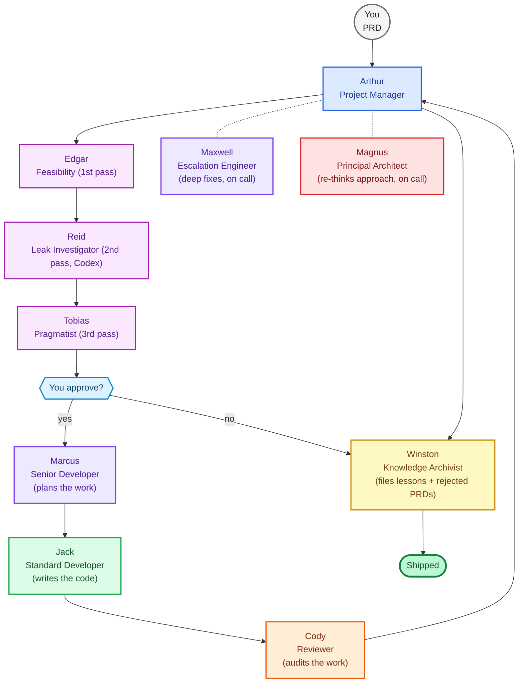

<div align="center">

# 🏛 Pantheon Mini

### **10 AI agents. One small studio. One escalation ladder by attempt number.**

*The minimal viable software house. Ships PRs without the 33-agent overhead.*

[](LICENSE)
[](README_INSTALL.md)
[](#-the-active-mini-operating-team)
[](https://github.com/5percentdrops/pantheon)
[](#-quick-start)
[](https://github.com/5percentdrops/pantheon-mini/stargazers)

```
You write the PRD. Pantheon Mini ships the PR. With 10 agents, not 33.
```

</div>

---

## ⚡ Install in 30 seconds

```bash
git clone https://github.com/5percentdrops/pantheon-mini.git && cd pantheon-mini && bash scripts/one_click_install.sh -y --setup-keys
```

10 AI agents wake up. Each has a name, a model, a memory, a job, and a fixed slot on the escalation ladder. Coexists with full Pantheon on the same host — `~/.hermes-mini-*` namespace.

---

## 💥 Why Mini exists

**Problem with full Pantheon:** 33 agents = 33 LLM connections = real token spend. Overkill for solo projects, prototypes, weekend builds.

**Mini's deal:** Same Paperclip+Hermes architecture, same V8.10–V8.15 hardening, same `SOUL.md`/`MEMORY.md`/skills loop — but only **10 active agents** (7 build + 3 PRD-intake feasibility reviewers). Specialist work (frontend, mobile, devops, qa, pinescript, quantower) is intentionally collapsed onto Jack (implementer) or Marcus (planner). The 23 inactive Pantheon roles are placeholders for schema parity only.

Same patterns. Same contracts. Same observability. ~3x cheaper to run.

---

## 🆚 Mini vs Full Pantheon

| | Full Pantheon | **Pantheon Mini** |
|---|---|---|
| Active agents | 33 | **10** |
| Inactive placeholders | 0 (all live) | 23 (activate when needed) |
| PRD intake | advisory pipeline (Owen/Vera/Graham/Stone/Adrian) | **3-pass feasibility (Edgar/Reid/Tobias)** |
| Escalation model | per-role | **attempt-numbered ladder** (1-12, 13-15, 16-17, 18, 19, archive, merge) |
| Arthur model | GPT-5 mini | **GPT-5 mini** |
| Implementer | Jack/Ben/Theo/Leo/Ellie/Grant (specialist fan-out) | **Jack alone** (DeepSeek) |
| Senior planner | Marcus | **Marcus** (also covers SDD/feature/red-test) |
| Reviewer/auditor | Clara → Cody | **Cody alone** (GPT-5.5, attempt 18) |
| Hermes namespace | `~/.hermes-*` | `~/.hermes-mini-*` |
| Patches | V8.5 → V8.10 | **V8.5 → V8.15, 0 parity gaps** |
| Daily token spend (heavy day) | $5–$20 | **$1–$5** |

**Run both on same host:** zero collision. Use Mini for prototypes; Pantheon for production.

---

## 🏛 The Active Mini operating team

**At a glance:** PRD goes in, working code comes out.

```
 PRD ──► Arthur ──► Marcus ──► Jack ──► Arthur ──► Winston
 you route plan build merge archive
```

**The team:**



**The flow:** PRD enters at top. Arthur runs it through a 3-pass feasibility loop (Edgar → Reid → Tobias) before anyone writes code. You see the consolidated report and approve, trim, iterate, or reject. If approved, Marcus plans, Jack codes, Cody audits, Arthur merges, Winston archives. Maxwell and Magnus are on-call when Jack is genuinely stuck. Rejected PRDs also go to Winston so we learn what we kill.

| # | Role | Agent | Phase | Model |
|--:|---|---|---|---|
| 1 | 🎯 **Project Manager / Head** | Arthur | intake · merge gate | GPT-5 mini |
| 2 | 🔎 **Feasibility Analyst** (1st pass) | Edgar | PRD intake | Opus 4.7 XHigh |
| 3 | 🕵 **Leak Investigator** (2nd pass) | Reid | PRD intake | GPT-5.5 Codex |
| 4 | ⚖ **Pragmatist** (3rd pass) | Tobias | PRD intake | Opus 4.7 XHigh |
| 5 | 📋 **Senior Developer / Planner** | Marcus | plan · attempts 13-15 | Opus 4.7 XHigh |
| 6 | 🔨 **Standard Developer / Implementer** | Jack | build · attempts 1-12 | DeepSeek V4 Pro |
| 7 | 🔍 **Independent Reviewer / Auditor** | Cody | audit · attempt 18 | GPT-5.5 |
| 8 | 🔥 **Staff Escalation Engineer** | Maxwell | attempts 16-17 | Opus 4.7 Max |
| 9 | 🏗 **Principal Architect** | Magnus | attempt 19 | Gemini 3.1 Pro |
| 10 | 📚 **Knowledge Archivist** | Winston | final archive + rejected PRDs | Haiku 3.5 |

**Ladder is the source of truth:**
Jack 1-12 → Marcus 13-15 → Maxwell 16-17 → Cody 18 → Magnus 19 → Winston archives → Arthur merges (or Magnus terminates to manual review).

### 🏗 Magnus — Principal Architect (attempt 19)

When Marcus's tactical fixes (13-15), Maxwell's deep fixes (16-17), and Cody's forensic audit (18) all fail, Arthur routes the blocker to **Magnus**. Magnus runs on **Gemini 3.1 Pro under Hermes** and is approach-focused, not code-focused — he never patches a file directly. Instead he produces a *Principal Approach Review*: 2-4 alternative structural pathways, an `APPROACH_SOLUTION_LOG` entry, and either a revised route Arthur can hand back to a senior, or a termination-to-manual-review verdict. Magnus is the only ladder tier with authority to kill the task.

**26 placeholder agents** stay dormant until you assign them a model — see [`SoftwareHouse/policies/mini_agent_role_map.yaml`](SoftwareHouse/policies/mini_agent_role_map.yaml) for the upgrade-to-full-Pantheon path.

---

## 🧠 What's inside (V8.16)

### 🪞 Each agent has a soul
```
~/.hermes-mini-magnus/
 ├── SOUL.md ← who they are
 ├── MEMORY.md ← what they've learned (grows forever)
 ├── USER.md ← who they report to
 ├── skills/
 │ ├── seed.md ← job manual (canonical seed) + Skill Router
 │ └── responsibilities/ ← 67 executable procedure cards (V8.16)
 │ ├── INDEX.md ← pipeline trigger → skill_id router
 │ └── *.md ← one card per responsibility
 └── sessions/ ← FTS5-searchable session history
```

### 🪜 Attempt-numbered escalation ladder
The defining V8.11 change. Mini drops the "12 active, several specialist seniors" model. The 7-agent Active Mini operating team owns every Pantheon role and routes by **attempt number**, not role family. Jack 1-12 → Marcus 13-15 → Maxwell 16-17 → Cody 18 → Magnus 19 → Winston archives → Arthur merges (or Magnus terminates). See [`docs/ROUTING.md`](docs/ROUTING.md).

### 🔒 Rigid handoff contracts
Every cross-agent handoff is a typed schema, not conversational text. Engineer → Marcus blockers use `engineer_escalation_packet.v1` (RTK trace, red test IDs, blocked-on enum = 7 active IDs). Senior → Arthur returns use `arthur_rtk_routing_packet`. Cody → Arthur reviews use `code_review_return_packet`. Magnus → Arthur approach reviews use `magnus_approach_review_packet`. Mis-routed handoffs fail at schema validation. Every pipeline declares `output_budget`; every stage declares `max_output_tokens` / `max_output_bytes` and an `input_contract`.

### 📐 Rubric-graded reviews
Cody grades implementations against `outcome.schema.json` rubrics on attempt 18 and auto-iterates with Jack before Magnus sees the work on attempt 19. Maxwell's escalation fixes (16-17) don't auto-merge — Cody re-grades against the same rubric. Max 2 iterations → Magnus.

### 💰 Per-host budget watcher
Arthur cron `*/15` sums per-agent tokens, alerts WARN @ 80% / CRIT @ 95% to `workspace/07_Finalization/budget_alerts.jsonl` + Arthur's MEMORY on CRIT. Pairs with Arthur's lane-concurrency cap (2 max).

### 🌐 Cross-agent learning + nightly dreaming
Each agent dreams at 03:00 UTC: sha256 dedup skills, consolidate MEMORY.md, SOUL.md immutable. Winston scrapes every `~/.hermes-mini-*` home at 04:00 UTC, dedups by sha256, writes `workspace/wiki/lessons_learned.md` that Jack pre-reads before TDD.

### 📊 Observability + system outcomes
`workspace/07_Finalization/metrics_dashboard.md` rolls up every alert sink. Weekly scorecard: pipeline-completion ≥90% · avg-iter ≤2 · escalation-rate ≤15% · 0 CRIT/week · ≥20% multi-agent lesson reinforcement. `escalate_to_board` lands in Arthur's MEMORY. Winston Sunday scan flags duplicate work (advisory).

### ⚡ Single-implementer fan-out
Mini's fan-out collapses onto Jack (single-implementer pool, DeepSeek V4 Pro). Full Pantheon retains the multi-engineer specialist fan-out. V8.13 added parallel-Jack at the implementation stage when Marcus's tickets have disjoint `touches` sets.

### 🔪 Per-agent tool scoping (V8.12)
Sharper specialization. Marcus has no terminal (planner). Cody has no write (reviewer). Winston has no web (archivist). Each agent's `~/.hermes-mini-<slug>/config.yaml` declares a role-specific toolset — least-privilege at the agent boundary.

### 🧭 Pre-ladder Cody reviews + self-grading (V8.12)
Cody now has 6 review modes — 5 are cheap pre-ladder checkpoints (SDD review, ticket review, red-TDD review, pre-PR review, mid-Maxwell grading) that catch plan errors before they become 12-attempt blockers. Each pipeline stage self-grades against a rubric (`SoftwareHouse/rubrics/`) before handing off. Hard-fail criteria (`actually_red`, `all_red_now_green`, `no_test_relaxation`) stop the pipeline cold.

### 🪟 Mid-Maxwell grading (V8.13)
Cody scores Maxwell's solution drafts (attempts 16-17) BEFORE they reach Jack. Sub-threshold drafts bounce back to Maxwell within his author-cycle budget — Jack never burns cycles testing a fix Cody can already tell is bad. `no_test_relaxation` hard-fail triggers early Magnus escalation.

### 🔎 3-pass PRD feasibility intake (V8.14)
Every PRD passes through Edgar (Opus 4.7) → Reid (GPT-5.5 Codex) → Tobias (Opus 4.7) BEFORE Marcus sees it. Edgar checks feasibility + hallucination, Reid leak-checks Edgar from a Codex perspective, Tobias arbitrates + flags user pie-in-sky. User approval gate before Marcus is invoked. Rejected PRDs archived by Winston for lessons-learned.

### 🪡 Diff-aware iterate cycles (V8.15)
When you revise a PRD (`<slug>-v2.md`), Arthur runs `scripts/diff_prd_versions.py` to detect changed sections. Edgar + Reid re-review only the changed sections (carrying forward unchanged-section verdicts); Tobias always re-runs full for cross-section safety. Forced-full fallback if change_ratio > 0.5 or structural drift. ~55-60% token savings on typical 1-section revisions.

### 🎴 Per-responsibility executable skills (V8.16)
Each active-mini agent (Arthur, Magnus, Marcus, Jack, Cody) now ships with a directory of **executable procedure cards** — one skill file per real-world responsibility, totaling **67 skills**. Each skill is a self-contained card: typed frontmatter (`skill_id`, `inputs`, `outputs`, `gates`, `escalation`), procedure steps, schemas, and hard rules.

Layout under [`SoftwareHouse/skills/role_responsibilities/`](SoftwareHouse/skills/role_responsibilities/):
```
role_responsibilities/
├── arthur/ 13 skills (scope lock, master status, dispatch, escalation ladder, merge gate)
├── magnus/ 10 skills (synthesis, route proposal, kill authority, architecture sign-off)
├── marcus/ 13 skills (SDD, contracts, tickets, red TDD, tactical fix, sanity review)
├── jack/ 12 skills (intake, implementation loop, test discipline, escalation packet)
└── cody/ 19 skills (6 review modes, classification gate, hard-fail triggers)
```

**Wired into install:** `scripts/seed_active_homes.py` reads each agent's `responsibility_skills_dir` from `SoftwareHouse/paperclip/agents.json` and copies the skill tree into `~/.hermes-mini-<slug>/skills/responsibilities/` at install time. `scripts/validate_responsibility_skills.py` is invoked by `one_click_install.sh` to confirm every skill has valid frontmatter and matching `owner_agent`.

**Skill Router in every seed:** each `skills/hermes_seed/skill_<agent>_seed.md` now ends with a Skill Router table mapping pipeline trigger → skill_id, so the agent loads the right procedure card when entering any stage. The seed is the job manual; responsibility skills are the per-stage procedure.

Anchored by [`ROLES.md`](ROLES.md) — every responsibility in the real-world column has a matching skill on the agent-execution side. Top-level overview: [`SoftwareHouse/skills/role_responsibilities/README.md`](SoftwareHouse/skills/role_responsibilities/README.md). Per-agent stage→skill index in each `agent/INDEX.md`.

**Patches archive (V8.5 → V8.16):** [`V8.10`](PATCH_NOTES_MINI_V8_10.md) · [`V8.11`](PATCH_NOTES_MINI_V8_11.md) · [`V8.12`](PATCH_NOTES_MINI_V8_12.md) · [`V8.13`](PATCH_NOTES_MINI_V8_13.md) · [`V8.14`](PATCH_NOTES_MINI_V8_14.md) · [`V8.15`](PATCH_NOTES_MINI_V8_15.md) · [`V8.16`](PATCH_NOTES_MINI_V8_16.md)

---

## 🚀 Quick start

### 1. Prereqs (5 min, one time)
```bash
node --version # ≥ 20
python3 --version # ≥ 3.11
npm install -g paperclipai # ≥ 2026.513.0
# Install hermes per https://github.com/NousResearch/hermes-agent
```

### 2. Pull Pantheon Mini
```bash
git clone https://github.com/5percentdrops/pantheon-mini.git
cd pantheon-mini
```

### 3. Fire it up
```bash
bash scripts/one_click_install.sh -y --setup-keys
```

The 8-step installer:
1. ✅ Workspace mkdir
2. ✅ Validators (V7 baseline + V8.11–V8.15 alignment, 23/23 PASS)
3. ✅ (V7 baseline kept — no agentcompanies/v1 conversion in mini)
4. 🏠 Bootstrap **7 per-agent `~/.hermes-mini-<slug>/` homes** (Arthur, Marcus, Jack, Cody, Maxwell, Magnus, Winston)
5. 🔑 Securely prompt for API keys (hidden input, chmod 600, zero network)
6. 🔌 Register `hermes_local` Paperclip adapter
7. 🌙 Install nightly Dreaming + Winston aggregator + V8.9 observability crons
8. 🏛 Manual `paperclipai company import` reminder

### 4. Ship something
```
Open Paperclip → Pantheon Mini → Arthur
Send: "Build a CLI tool that counts unique words in a file."
Watch Arthur → Marcus → Jack → green → Arthur → merge.
(On stuck: Jack 1-12 → Marcus 13-15 → Maxwell 16-17 → Cody 18 → Magnus 19.)
```

---

## ✅ Parity check

Mini ships its own parity tool:

```bash
python3 scripts/parity_check_against_pantheon.py
```

Output:
```
✅ PARITY PASS — Pantheon Mini matches full Pantheon's structural surface.
 Only delta: active agent count (7 mini vs 33 full) and agent-specific paths.
```

---

## 🛡 Security posture (same as full)

- 🔒 `setup_api_keys.sh` — `umask 077` · `chmod 600` · `read -s` (no echo) · zero network
- 🚫 No keys / `.env` / PEM in repo (`.gitignore` enforces)
- 🚷 Production trading keys forbidden in general agents
- 🧱 Per-agent isolation via `~/.hermes-mini-<slug>/`

---

## 🌍 OS matrix

| OS | Status |
|---|---|
| 🐧 Linux | ✅ |
| 🍏 macOS | ✅ |
| 🪟 Windows (WSL2) | ✅ |
| 🪟 Windows native | ❌ — use WSL |

---

## 📊 Verify the install

```bash
python3 scripts/validate_v8_10_mini.py # V8.11–V8.15 alignment fast check (PASS)
bash scripts/run_all_validators.sh # full 23-validator sweep (PASS=23 FAIL=0)
python3 scripts/audit_readiness.py # 10/10 active agents pass readiness criteria
python3 scripts/parity_check_against_pantheon.py # 0 parity gaps vs full
ls -d ~/.hermes-mini-* | wc -l # 7 homes
cat workspace/07_Finalization/metrics_dashboard.md # after first cron tick
```

---

## ❓ FAQ

**Q: Why use Mini instead of full Pantheon?**
3x cheaper. 10 agents instead of 33. Same V8.10 architecture + V8.11 attempt-numbered ladder + V8.12 self-grading rubrics + V8.13 mid-Maxwell grading + V8.14 3-pass feasibility intake + V8.15 diff-aware iterate. Use Mini for prototypes, full for production.

**Q: Can I run Mini and full Pantheon on the same machine?**
Yes. Mini uses `~/.hermes-mini-*`, full uses `~/.hermes-*`. Zero collision.

**Q: How does Mini handle frontend / mobile / devops / qa / pinescript / quantower work?**
All specialist implementation lanes route to Jack (Standard Developer / Implementer). Senior specialist planning routes to Marcus. This is intentional — Mini is the minimum viable lane, not a coverage-equivalent of full Pantheon.

**Q: Why an attempt-numbered ladder instead of role-based?**
Predictable budget exhaustion. Jack gets 12 attempts; Marcus 3 more; Maxwell 2 more; Cody 1 audit; Magnus 1 architectural rethink. After attempt 19, Magnus can terminate the lane to manual review.

**Q: Can I activate the 26 dormant agents?**
Yes. Assign a model in `SoftwareHouse/paperclip/agents.json`, re-run `scripts/one_click_install.sh`. See [`mini_agent_role_map.yaml`](SoftwareHouse/policies/mini_agent_role_map.yaml#upgrade_to_pantheon_parity).

**Q: Does Mini have everything full has?**
Yes structurally. Parity check enforces it. Only delta is **active agent count** + agent-specific files.

**Q: Why "Pantheon Mini"?**
Because it's literally a mini version of Pantheon. Same architecture, smaller pantheon.

---

## 📚 Deeper docs

- [`README_INSTALL.md`](README_INSTALL.md) — full install guide
- [`SMOKE_SCALE.md`](SMOKE_SCALE.md) — 2 → 7 agent phased ramp
- [`PATCH_NOTES_MINI_V8_15.md`](PATCH_NOTES_MINI_V8_15.md) — V8.15 diff-aware iterate re-review
- [`PATCH_NOTES_MINI_V8_14.md`](PATCH_NOTES_MINI_V8_14.md) — V8.14 3-pass PRD feasibility intake (Edgar/Reid/Tobias)
- [`PATCH_NOTES_MINI_V8_13.md`](PATCH_NOTES_MINI_V8_13.md) — V8.13 parallel Jacks + mid-Maxwell grading + ticket `touches`
- [`PATCH_NOTES_MINI_V8_12.md`](PATCH_NOTES_MINI_V8_12.md) — V8.12 tool scoping + pre-ladder reviews + rubrics
- [`PATCH_NOTES_MINI_V8_11.md`](PATCH_NOTES_MINI_V8_11.md) — V8.11 shrink to 7-agent Active Mini
- [`PATCH_NOTES_MINI_V8_10.md`](PATCH_NOTES_MINI_V8_10.md) — V8.10 alignment patch list
- [`SoftwareHouse/policies/mini_agent_role_map.yaml`](SoftwareHouse/policies/mini_agent_role_map.yaml) — Pantheon ↔ Mini role substitutions + escalation ladder
- [`examples/mini_weekly_intel_walkthrough.md`](examples/mini_weekly_intel_walkthrough.md) — concrete pipeline trace

---

## 🚧 Boundary

Mini **does not** install Paperclip, Hermes, provider API keys, or production trading keys. It stages a company/org package. **Bring your own runtime, your own keys.**

---

## 📜 License

MIT — see [`LICENSE`](LICENSE). Same as full Pantheon.

---

<div align="center">

### 🌟 If Pantheon Mini ships its first PR for you, [drop a star.](https://github.com/5percentdrops/pantheon-mini/stargazers)

*Full Pantheon (33 agents): https://github.com/5percentdrops/pantheon*

</div>
